The project is based on AutoGenerator[https://github.com/i17c/AutoGenerator.git]. And some changes have been made to adjust spring jpa, function of analysis from table was
added, and support for encoding GBK and scala was removed.

## Quick start  
table user is used for next example
  ```
  create table user
  (
      user_id       bigint auto_increment not null
          primary key comment '用户ID',
  
      user_name     varchar(50)           not null comment '用户名',
      password      varchar(50)           not null comment '密码',
  
      region_id     int                   not null comment '所在地区ID',
      cellphone     varchar(64)           not null comment '电话号码',
      state         int                   not null comment '状态',
      create_time   bigint                not null comment '创建时间',
      modified_time bigint                not null comment '修改时间'
  )

  ```
1. Tools->table2crud or shortcut ```alt+shift+u``` to enter the tool  
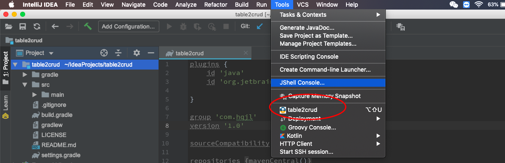
and the main page is like this
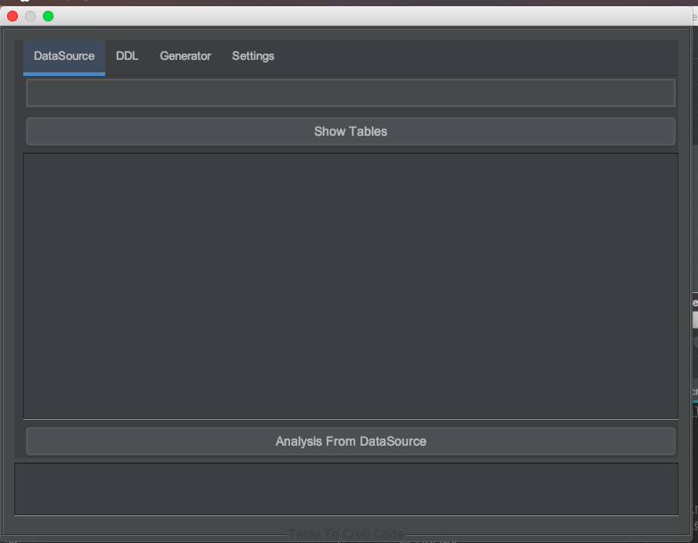

2.enter setting which is in the last tab
and fill datasource info
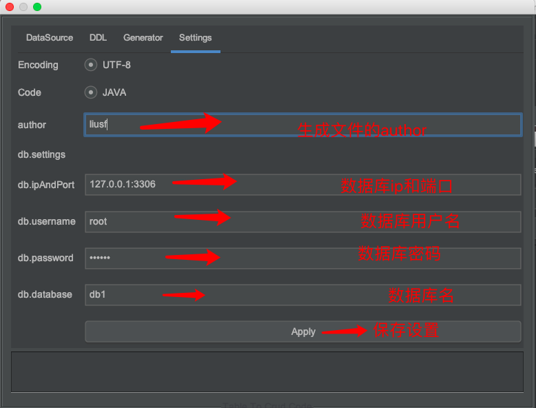

3.press apply and enter first tab, enter keyword of your table and then click show tables.
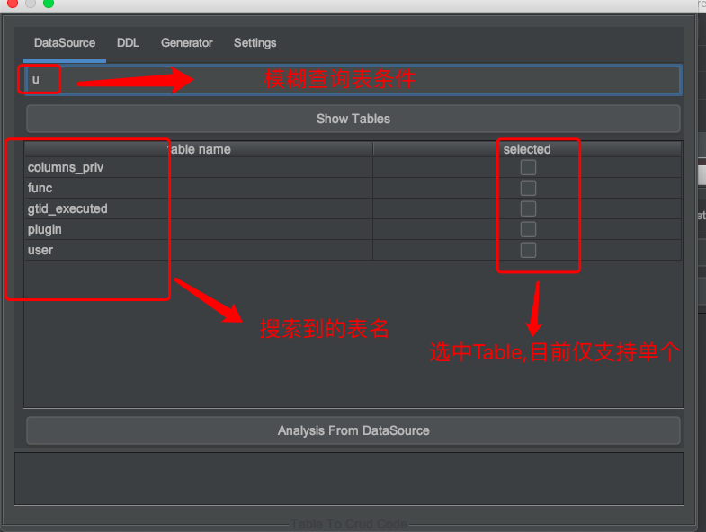

4.select table user and then click button ```Analysis from DataSrouce```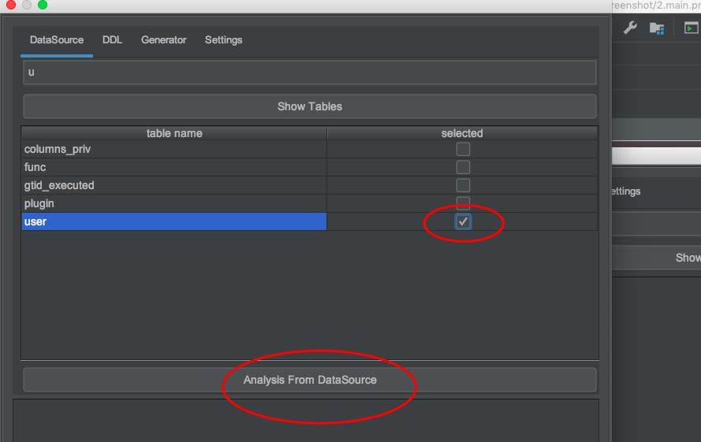  
5. Table schema will be showed on the Generator
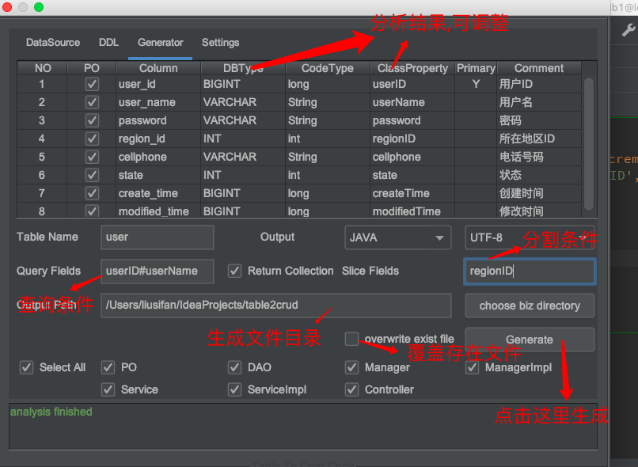 
6. click generator and related files will generated.
7. generated files is not formatted, show we should select these files and press ```ctrl+alt+l``` to format them.
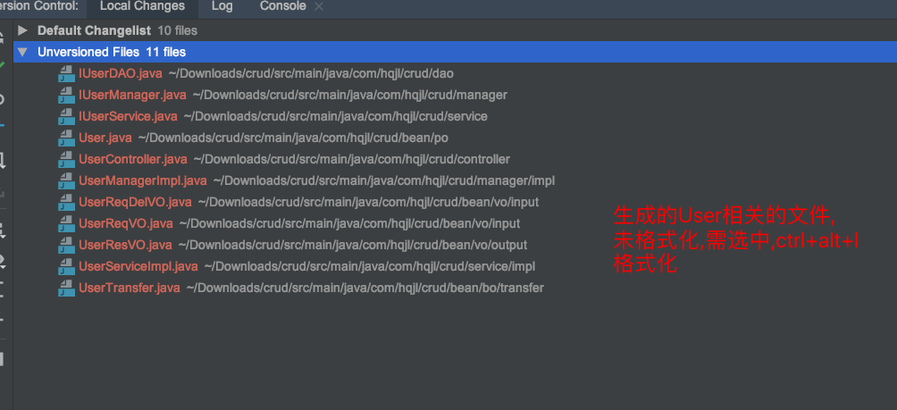
8. generated files is like this
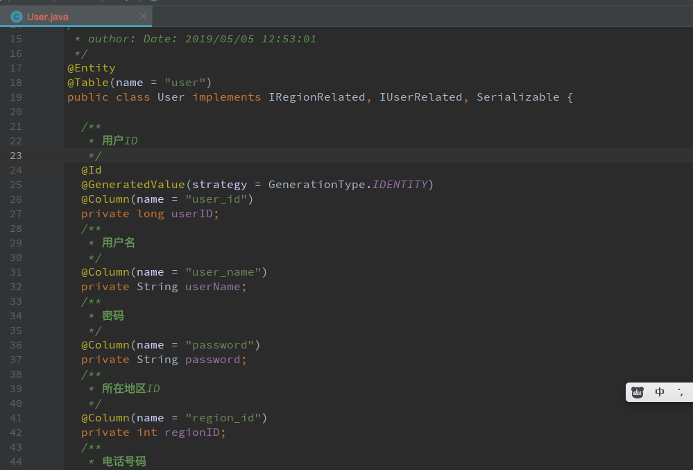
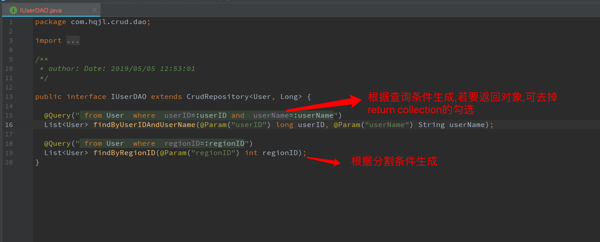
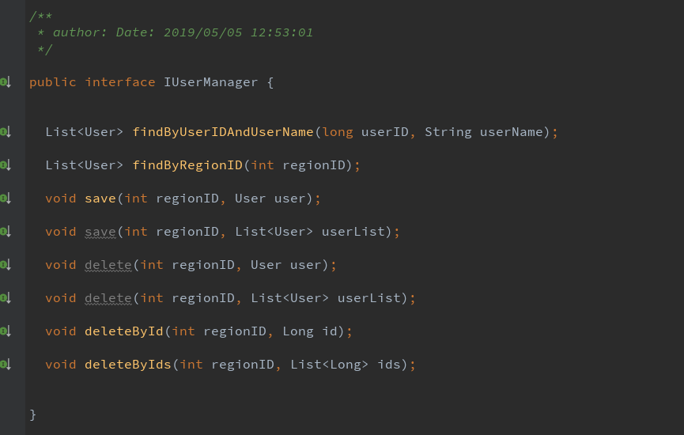
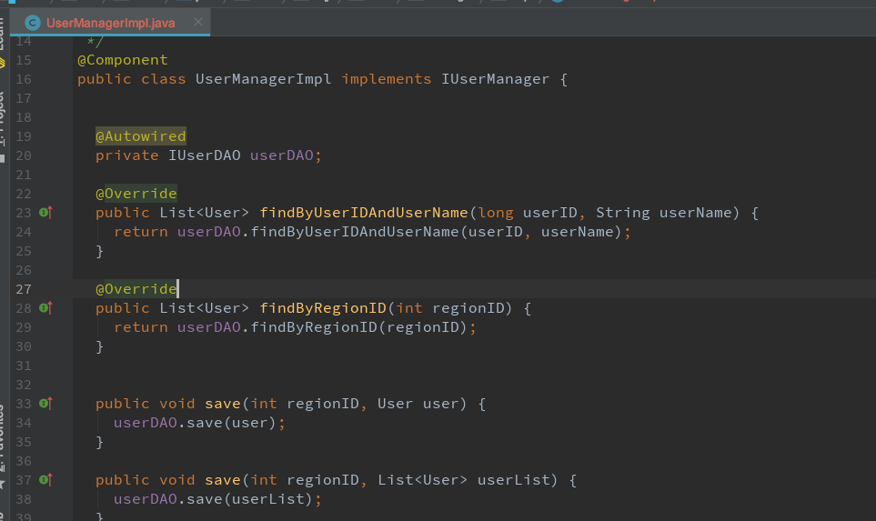
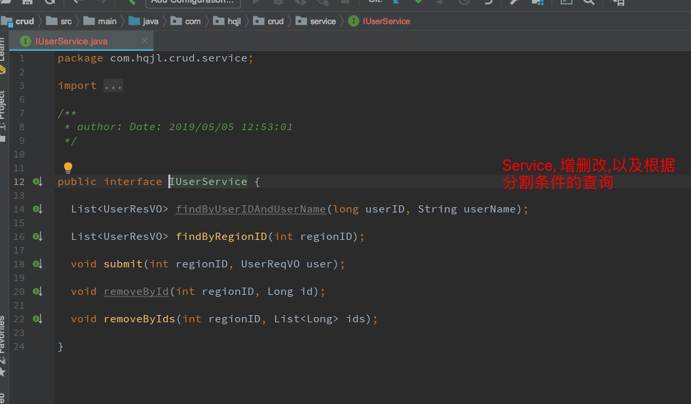
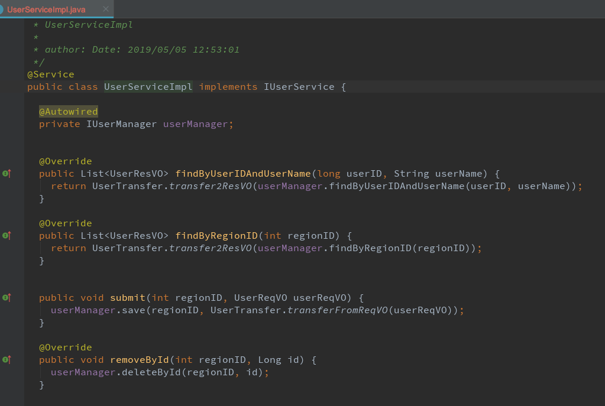
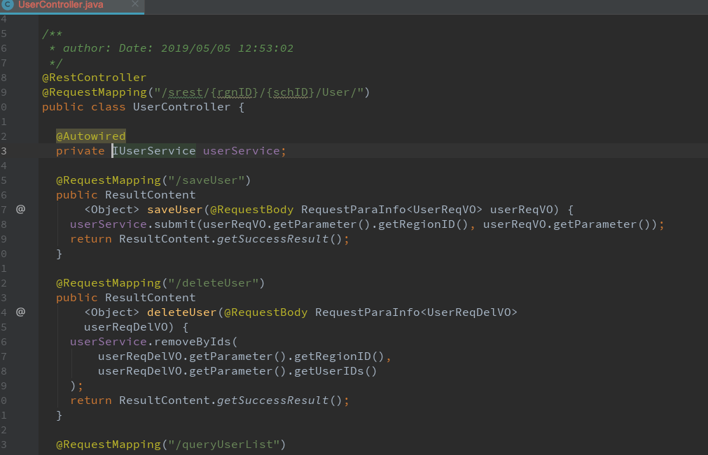
 

